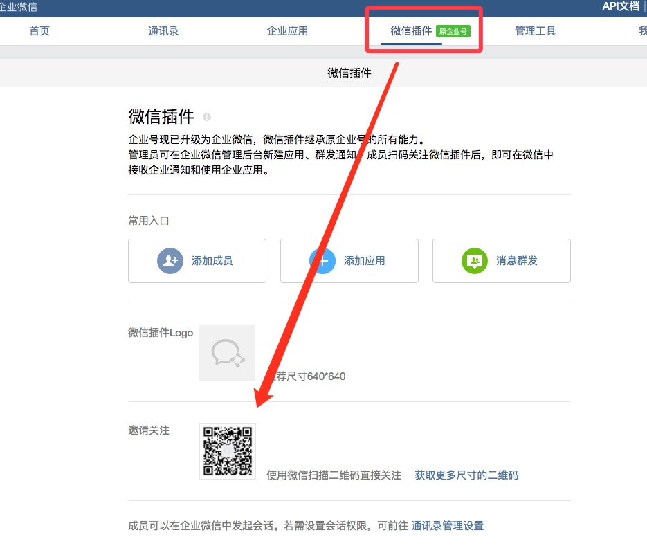

# 企业微信号


---

### 一.申请企业号
1. 以个人邮箱申请就可以, 不通过企业认证的话,有200人的限制,一般足够用了

### 二.获取对接权限
1. 获取corpid
    登录后,我的企业 ----> 企业信息  --> CorpID
    将 CorpID 配置到配置文件 config.conf 内 的 CorpID
    
    
    
    
2. 开启回调模式获取key
    登录后,顶部菜单[企业应用] ----> 添加应用
    进入新添加的应用
    拿到 AgentId 和 Secret
    
    
    
    进入 [接收消息] 设置
    > 1. URL: 填写你服务器地址:端口/auth( 例如: http://yanjunhui.com:4567/auth )
    > 2. Token: 随机获取(这个发送信息用不到,可忽略)
    > 3. EncodingAESKey: 随机获取,就是我们在配置文件配置的 EncodingAESKey
    
3. 使用微信关注企业号才可以从微信收到信息,否则只能从微信企业号 APP 中收到信息
	
	

### 完成以上步骤后, 即可实用OpenFalcon发送信息,发送格式与 sender 符合:
    tos     微信用户名
    content 信息内容
    

### OpenFalcon+ 配置:

修改配置文件 https://github.com/open-falcon/falcon-plus/blob/master/modules/alarm/cfg.example.json#L25

```
"api": {
        "sms": "http://yanjunhui.com:4567/send",
        "mail": "http://127.0.0.1:10086/mail",
        "dashboard": "http://127.0.0.1:8081",
        "plus_api":"http://127.0.0.1:8080",
        "plus_api_token": "used-by-alarm-in-server-side-and-disabled-by-set-to-blank"
    },
```


### OpenFalcon 配置

1. 如果只需要微信提醒, 只修改 OpenFalcon 的 Sender 的配置文件 sms 的地址: http://IP:4567/sendmsg:
	例如:

```
    "api": {
        "sms": "http://yanjunhui.com:4567/send",
        "mail": "http://11.11.11.11:9000/mail"
    }
```


2. 如果同时需要短信和微信提醒,可以使用修改版的[Sender](https://github.com/Yanjunhui/sender),配置如下:

```
    "api": {
        "sms": "http://11.11.11.11:8000/sms",
        "mail": "http://11.11.11.11:9000/mail"
        "chat": "http://11.11.11.11:4567/send"
    }
```

### 使用
> 1. 启动 `./control.sh start`
> 2. 停止 `./control.sh stop`
> 3. 重启 `./control.sh restart`
> 4. 状态 `./control.sh status`
